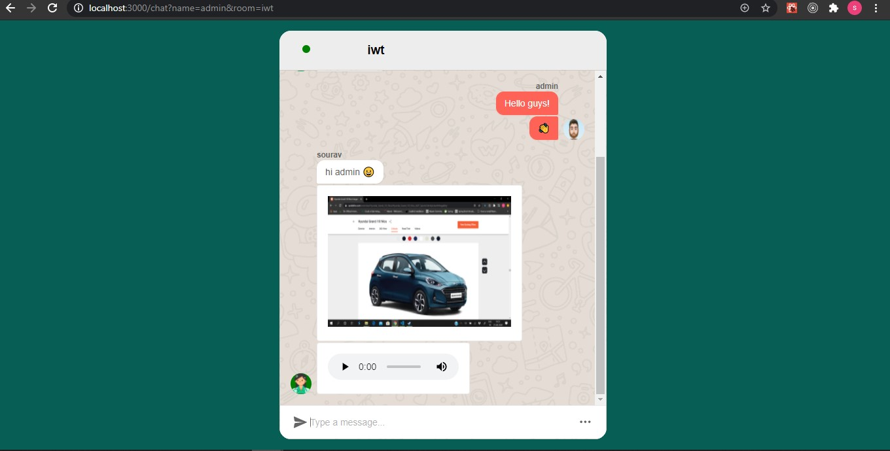

# JustChat

## Screenshots





## How we built it 🏁 Technology Stack

**Frontend**
* [React](https://reactjs.org/)


**Backend**
* [Nodejs](https://nodejs.org/en/)
* [mongoDB](https://www.mongodb.com/)
* [express](https://expressjs.com/)

## Prerequisties

**For backend and web app**
* node and npm installed

## Installation & Setup 

A step by step series of examples that tell you how to get a development env running

**To start the server**
Go to root of the project, run

```
cd texting-api
```


```
npm install
```

```
npm start
```

Server will be running on localhost

**To start the web app**
Go to root of the project, run

```
cd texting-client
```

```
npm install
```

```
npm start
```

A react app will be running on your browser.

**set up env file**

In the texting-api directory

```
MONGODB_URI = ''

```


## Team Members
* Sourav Kunda            
* Siddhant Sharma
* Deepak Sharma
* Siddharth Raja
